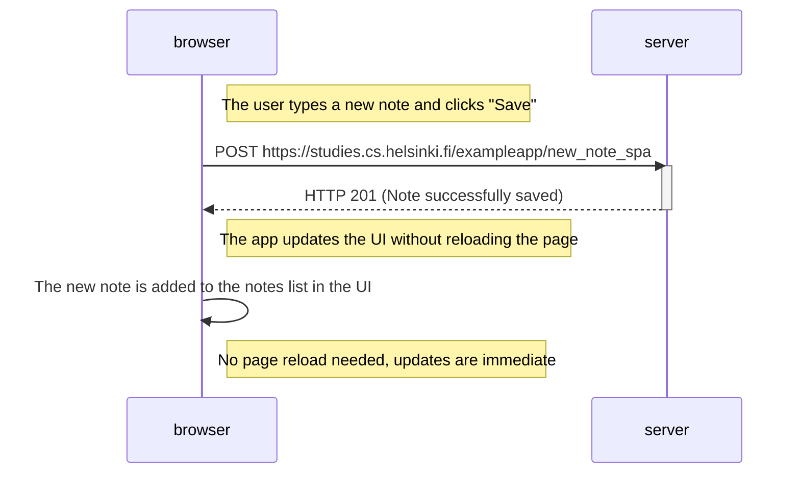

---

## **Exercise 0.6: New Note in SPA**

This sequence diagram describes what happens when a user creates a new note in the SPA version:

````markdown

```mermaid
sequenceDiagram
    participant browser
    participant server

    Note right of browser: The user types a new note and clicks "Save"

    browser->>server: POST https://studies.cs.helsinki.fi/exampleapp/new_note_spa
    activate server
    server-->>browser: HTTP 201 (Note successfully saved)
    deactivate server

    Note right of browser: The app updates the UI without reloading the page

    browser->>browser: The new note is added to the notes list in the UI

    Note right of browser: No page reload needed, updates are immediate
```
````
